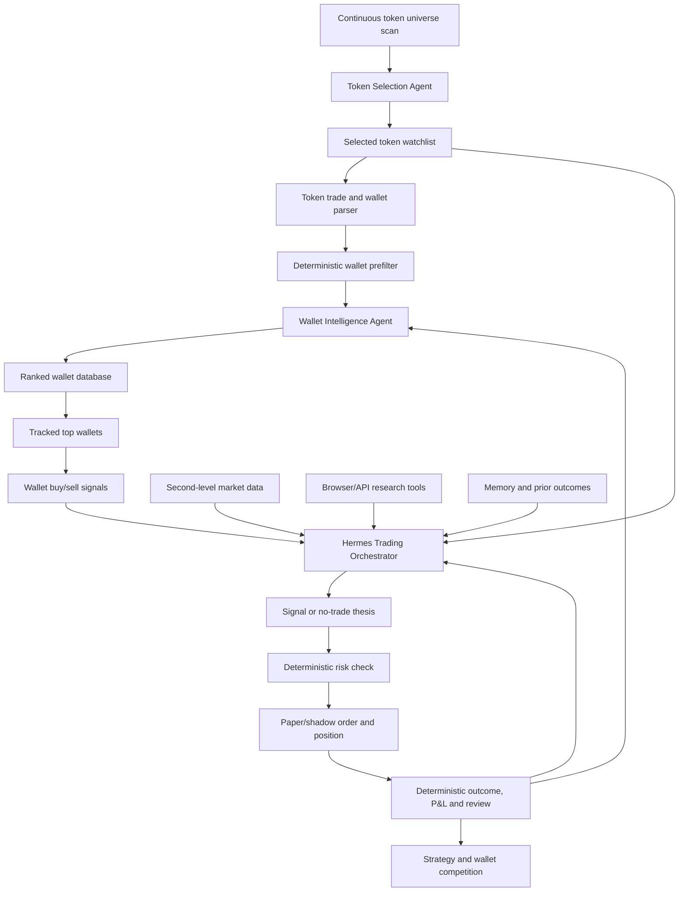

# Final Agentic Trading System

## System Identity

TraderV1 V2.0 is an agentic Solana token trading research system. Its core value is not a fixed buy/sell script. Its core value is an AI-controlled research and decision loop that continuously reads market evidence, wallet behavior and execution feedback, then chooses the best current token opportunity under deterministic risk and accounting constraints.

The final system has three primary AI decision layers:

1. Token Selection Agent.
2. Wallet Intelligence Agent.
3. Hermes Trading Orchestrator.

The deterministic codebase remains essential, but it is subordinate to this architecture. Scripts do not decide that a metric equals an entry. They collect data, normalize it, expose tools, calculate facts and enforce risk/accounting. Agent decisions are contextual synthesis over many evidence streams.

## Target Operating Loop

## Authority Model

| Layer | Authority | Must not do |
|---|---|---|
| Data scripts and adapters | Fetch token, wallet, transaction, holder, liquidity and market data | Decide final buy/sell action |
| Deterministic services | Normalize evidence, calculate P&L, enforce risk, simulate fills, store immutable records | Replace agent synthesis |
| Token Selection Agent | Choose which tokens deserve active attention | Open positions directly |
| Wallet Intelligence Agent | Rate wallets, explain why they are included/excluded, maintain competition | Treat historical P&L as proof by itself |
| Hermes Trading Orchestrator | Combine all context into paper/shadow decisions | Bypass risk or ledger |
| Risk engine | Veto any entry/exit | Generate speculative alpha |
| Evaluation engine | Calculate canonical P&L, expectancy, drawdown and win rate | Rewrite history |

## What Scripts Are For

Scripts and services must be built as typed tools:

- scan token universe;
- fetch token profile and holder data;
- fetch recent token trades;
- reconstruct wallets that traded a token;
- calculate token-specific wallet ROI;
- calculate wallet multi-month P&L and win rate;
- fetch current second-level market snapshots;
- monitor tracked wallet transactions;
- open browser/API research jobs;
- create immutable evidence references;
- run risk checks;
- create paper/shadow orders and exits;
- calculate outcomes and reports.

They should return structured evidence with timestamps, source quality and provenance. They should not return "buy this token because rule X fired" as an authoritative decision.

## Token Selection Philosophy

The Token Selection Agent does not search for any token that pumped. It searches for tokens stable enough to trade and rich enough in evidence for agentic analysis.

Inputs include:

- market cap and FDV buckets;
- liquidity and route depth;
- holder count and holder concentration;
- volume and transaction growth over recent windows;
- buy/sell balance and transaction velocity;
- token age and lifecycle phase;
- source quality and timestamp freshness;
- availability of trade history and wallet-level evidence;
- presence of potentially strong wallets;
- current spread, volatility and slippage risk;
- prior strategy outcomes for similar token buckets.

The agent can choose "watch", "research deeper", "skip", "pause" or "promote to active market loop". These are agent decisions, not direct consequences of one metric.

## Wallet Intelligence Philosophy

The Wallet Intelligence Agent is the main edge-discovery layer.

Candidate wallets enter through a funnel:

1. A token is selected as interesting.
2. Scripts parse token trades and wallets that interacted with it.
3. Deterministic prefilters identify wallets that exited this token with meaningful profit, for example above 20% ROI and with non-trivial notional size.
4. Scripts reconstruct the wallet's broader recent history across multiple tokens and months.
5. Deterministic metrics calculate total P&L estimate, win rate estimate, sample size, concentration, holding behavior, speed, position size, bot-like features and data quality.
6. Wallet Intelligence Agent reviews the surviving wallet candidate, writes a reasoned rating, and decides whether it enters the ranked wallet database.
7. Ranked wallets continue competing through forward paper/shadow contribution.

Win rate is required as a quality signal, but it is not the objective. Positive P&L and positive expectancy remain primary. Win rate exists to reduce lucky one-trade wallets, one-token concentration and pathological payoff profiles. A low win rate can still be acceptable if payoff and drawdown are strong; a high win rate can still be rejected if P&L is tiny, sample size is weak or behavior is bot-like.

## Hermes Trading Orchestrator Philosophy

Hermes is the main decision-maker inside the safe boundary.

When a tracked wallet signal arrives, Hermes should:

1. Identify the token, wallet and transaction context.
2. Pull the wallet's rating, personality profile, recent reliability and forward contribution.
3. Start or refresh an active token session.
4. Request market data repeatedly through an adaptive cadence policy: normal tokens slower, active tokens faster, open positions highest priority, and degraded cadence when sources cannot sustain load.
5. Compare wallet signal timing against price action, liquidity, spread, volatility and other tracked wallets.
6. Optionally open browser/API research tools for token pages, holder views or unavailable API facts.
7. Decide whether to create a structured paper/shadow `Signal` or a `NoTradeSignal`.
8. Let deterministic risk check veto unsafe entries.
9. Monitor entry, position and exit through active session state.
10. Review the outcome and update wallet, strategy and memory artifacts.

Hermes can decide to trade, skip, watch longer, exit early, wait for confirmation, or downgrade a wallet. It must not be constrained to simple "if metric then action" rules.

## Success Definition

V2.0 succeeds when the system can run continuously and produce:

- a live-updating token watchlist selected by an AI agent;
- a competitive wallet database with AI ratings and deterministic metrics;
- tracked wallet signals as one input to Hermes, not the only input;
- adaptive active market sessions for tokens under consideration, including second-level evidence where sources can support it;
- paper/shadow signals, no-trades, entries and exits with pre-action reasoning;
- deterministic risk, fills and P&L;
- forward evaluation showing whether agent-selected wallets and tokens improve net P&L after costs.
