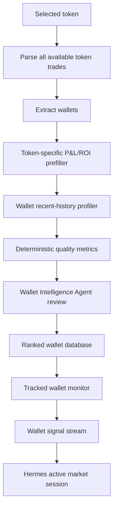

# Wallet Funnel And Market Loop

## Wallet Funnel

The wallet funnel is the most important V2.0 data pipeline.



## Token-Specific Prefilter

The prefilter exists to remove obvious noise before the Wallet Intelligence Agent spends reasoning budget.

Suggested evidence thresholds are priors, not final decisions:

- token-specific ROI above 20%;
- non-trivial realized profit/notional size;
- complete or reconstructable buy/sell path;
- timestamp quality sufficient to avoid hindsight;
- not only one dust trade;
- not immediately bot-like from transaction frequency.

Higher ROI buckets should be preserved, for example 20-50%, 50-100%, 100-200%, 200%+. The agent should see the bucket and context, not just a binary pass/fail.

## Broader Wallet Profiler

After token-specific prefilter, scripts must pull recent wallet history across months.

Minimum outputs:

- realized P&L estimate by token;
- total realized P&L estimate;
- net P&L after fees/slippage assumptions when possible;
- win rate estimate;
- closed trade count;
- average win, average loss and payoff ratio;
- holding time distribution;
- position size distribution;
- liquidity at entry and exit;
- one-token concentration;
- repeated token category behavior;
- copyability delay tolerance;
- suspicious behavior flags;
- data quality flags and missing evidence.

The profiler is deterministic. It can say "this wallet had positive estimated P&L and 61% win rate over 43 closed trades". It must not say "therefore track this wallet" as the final decision.

## Wallet Database

The ranked wallet database must store both deterministic metrics and agent judgment.

Required views:

- active elite wallets;
- probation wallets;
- watch-only wallets;
- rejected wallets with reasons;
- archived/stale wallets;
- wallet clusters;
- wallet rank history;
- forward contribution to paper/shadow P&L;
- demotion and promotion events.

Required invariant:

```text
A wallet enters the elite tracking set only through explicit Wallet Intelligence Agent review plus deterministic evidence refs.
```

## Wallet Personality Model

Hermes must build a compact behavioral model for each tracked wallet.

Examples:

- early entry, patient exit, medium notional;
- fast scalper, too difficult to copy;
- one-token lucky winner;
- cluster participant, possibly coordinated;
- insider-like early buyer;
- reliable trend confirmer;
- late exit signal only;
- strong in low-liquidity tokens but weak in high-volume tokens.

This personality model is not cosmetic. It tells Hermes how to interpret a signal:

- buy signal from an early hunter has different meaning than buy signal from a late confirmer;
- sell signal from a fast scalper may be less relevant for a longer paper thesis;
- multiple correlated wallets may count as one cluster, not many independent confirmations.

Personality modeling has a hard evidence boundary. If the transaction source does not provide enough wallet history, the agent must store an incomplete profile, for example:

```text
Wallet is interesting because it exited TOKEN with +43% estimated ROI, but broader wallet history is insufficient. Do not infer stable personality yet.
```

Allowed profile claims:

- observed directly from wallet transactions;
- inferred from enough repeated behavior and marked as inference;
- unknown because source depth is insufficient.

Forbidden profile claims:

- invented "personality" from one profitable token;
- stable behavior labels without sample size and history coverage;
- treating missing wallet history as positive evidence.

## Active Market Loop

When Hermes sees a wallet signal or a Token Selection Agent active-watch decision, it starts an active market session.

Required session inputs:

- token profile;
- current and recent market snapshots/candles at the best sustainable cadence;
- liquidity and route quality;
- tracked wallet entries/exits;
- recent holder/transaction changes when available;
- source freshness;
- open paper position state;
- prior outcome patterns for similar sessions.

Adaptive cadence:

- normal watched tokens: lower-frequency polling, for example 30-120 seconds depending on source limits and token priority;
- active tokens: higher-frequency polling, for example 2-10 seconds when source health supports it;
- open paper/shadow positions: highest-priority polling and exit checks, with 1-second snapshots only when feasible;
- source degradation: lower cadence, record degradation flags, and block high-confidence decisions if freshness becomes insufficient;
- Hermes review loop: adaptive, usually slower than raw data collection and driven by token risk, open-position status and source capacity;
- exit checks: priority over new entries;
- token research: lower priority than open position monitoring.

Hermes should not need to open a browser every time. Browser research is a tool for missing facts, semi-structured pages and cross-checking. API/indexer data is preferred for canonical market facts.

## Exit Signals

Tracked wallet exits are a first-class evidence stream.

Hermes should observe:

- whether the source wallet exits;
- whether other elite wallets exit;
- whether exits cluster in time;
- whether liquidity deteriorates;
- whether price action confirms or contradicts the exit;
- whether the wallet's historical personality makes its exit relevant.

Exit decisions must be recorded before simulated exit fills. Deterministic risk and paper/shadow execution remain mandatory.
