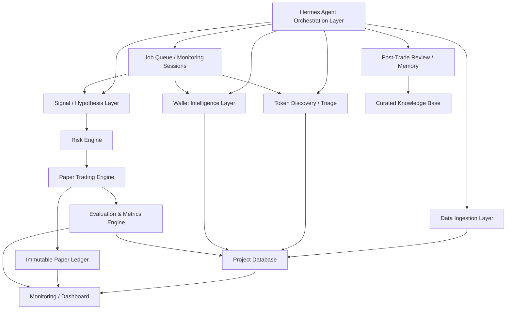

# 03. System Architecture

## Architecture overview

Система состоит из Hermes orchestration layer и набора deterministic services. Hermes думает, исследует, координирует и объясняет. Deterministic services собирают данные, ведут ledger, считают P&L, проверяют risk и оценивают стратегии.



## Layer responsibilities

| Layer | Purpose | Inputs | Outputs | LLM role | Deterministic role | Stored in DB | Positive expectancy connection |
|---|---|---|---|---|---|---|---|
| Hermes Agent Orchestration | Координация jobs, agents, reviews | Metrics, backlog, context | Tasks, summaries, decisions | Planning, research, prioritization | None for accounting | AgentDecision, task logs | Keeps search disciplined |
| Data Ingestion | Collect raw market/on-chain/social data | Solana, DEX, GMGN, social | Normalized events/snapshots | Can request collection | Adapters, retries, normalization | Raw events, snapshots | Prevents bad evaluation from bad data |
| Solana/GMGN/DEX Adapters | Source-specific access | APIs/RPC/browser | Source responses | None or extraction support | Typed adapters, rate limits | DataSource health | Controls source quality |
| Token Discovery | Find candidates | Market/on-chain events | TokenCandidate | Explains discovery context | Event detection | Candidates | Expands opportunity set |
| Token Triage | Prioritize or reject candidates | TokenProfile, market snapshot | Triage result | Contextual reasoning | Filters, vetoes, score | Triage decisions | Reduces noise |
| Wallet Intelligence | Profile wallets and clusters | Wallet trades, holdings | WalletProfile, WalletCluster | Behavior classification | P&L, holding, clustering metrics | Wallet profiles | Validates wallet edge |
| Market Context | Market regime and microstructure | Price, volume, liquidity | ContextSnapshot | Regime interpretation | Structured metrics | Market snapshots | Avoids regime-blind strategies |
| Social/Narrative Research | External context | X/news/community | Narrative signals | Summarization, contradiction checks | Source scoring | Context snapshots | Only useful if signal improves P&L |
| Signal Generation | Create testable trade hypotheses | Token/wallet/context data | Signal, TradeThesis | Thesis generation | Schema validation | Signals | Creates measurable decisions |
| Strategy Search | Compare and evolve hypotheses | Outcomes, experiments | StrategyVersion changes | Generate candidates | Leaderboard, stats | Experiments, versions | Selects better strategies |
| Job Queue / Monitoring Sessions | Parallelize bounded investigations | Token candidates, open positions, experiments | Per-token jobs, session status | Prioritizes and summarizes | Queue state, locks, leases, retries | Jobs, leases, session logs | Allows scale without swarm chaos |
| Paper Trading Engine | Virtual execution | Signal, risk result, market data | Orders, fills, positions | No P&L authority | Ledger, fills, positions | Paper ledger | Core proof layer |
| Risk Engine | Veto and limits | Signal, exposure, liquidity | RiskCheck | Explain risk context | Hard constraints | Risk checks | Prevents ruin/noise |
| Evaluation Engine | Metrics and scorecards | Ledger, outcomes | P&L, expectancy, drawdown | Interpretation only | Metrics calculation | Outcomes, metrics | Source of truth |
| Memory / Knowledge Base | Curated learnings | Reviews, experiments | MemoryEntry | Summaries, lessons | Evidence quality tags | Memory entries | Prevents repeated mistakes |
| Monitoring / Dashboard | Visibility | DB, ledger, metrics | UI, alerts | Narrative summary | Charts, status | Dashboard state | Detects degradation |
| Future Live Execution Extension - explicitly out of release runtime | Later real execution | Approved live signals | Transactions | No private keys | Execution adapter, risk gates | Audit logs | Future only after validation |

Paper Trading Engine cannot create `PaperOrder` unless deterministic `RiskCheck` has passed. The authoritative sequence is:

```text
Signal -> deterministic RiskCheck -> PaperOrder -> PaperFill -> PaperPosition
```

Do not create live execution module, private-key path, swap adapter, signer or DEX transaction code in this release.

## Error and risk controls

Each layer must handle:

- source latency and downtime;
- incomplete data;
- duplicated events;
- stale prices;
- failed fills;
- optimistic slippage estimates;
- manipulated wallets;
- social spam;
- LLM hallucinations;
- accidental hindsight;
- metric drift;
- strategy overfitting.

## Existing WalletScarper integration

`WalletScarper` should be treated as:

- existing data collector / adapter candidate;
- possible source of wallet and transaction raw data;
- not the only source of truth;
- not final Wallet Intelligence;
- requiring audit before integration;
- requiring normalized outputs, data confidence and immutable logging.

## Parallel monitoring architecture

The future 10-subagent idea should be implemented as **bounded parallel monitoring**, not as an unconstrained agent swarm.

Required components:

- durable job queue;
- per-token monitoring sessions;
- per-wallet-cluster analysis sessions;
- per-strategy experiment sessions;
- explicit lease/lock ownership;
- max parallel investigations;
- max open paper positions;
- max monitored tokens;
- priority queue for attention allocation;
- conflict resolution rules;
- session-local memory plus curated global memory.

## Monitoring session types

| Session type | Purpose | State owner | Stop conditions |
|---|---|---|---|
| `token_watch` | Monitor token candidate after triage | Token monitoring worker | Token stale, liquidity too low, thesis invalid, max age reached |
| `wallet_cluster_watch` | Track wallets/clusters linked to candidates | Wallet intelligence worker | Cluster degraded, insufficient evidence, manipulation risk |
| `paper_position_watch` | Monitor open paper position | Paper trading worker | Exit triggered, risk stop, time stop, data degraded |
| `hypothesis_test` | Run bounded strategy experiment | Strategy search worker | Budget used, kill criteria hit, promotion criteria reached |
| `browser_research` | Extract facts from web source without API | Browser adapter worker | Fact extracted, layout failure, source confidence too low |

## Token monitoring state machine

```text
discovered
  -> triage_pending
  -> monitoring
  -> signal_candidate
  -> risk_checked
  -> paper_position_open
  -> exit_pending
  -> closed_review_pending
  -> archived

Any state -> rejected
Any state -> degraded
Any state -> paused
```

## Attention allocation

When many tokens compete for analysis, attention is allocated by deterministic priority score, not agent excitement.

Priority inputs:

- source confidence;
- liquidity and execution feasibility;
- token age and lifecycle;
- wallet signal quality;
- active strategy experiment needs;
- open paper exposure;
- data freshness;
- expected value of information.

The queue must reserve capacity for:

- new token discovery;
- open paper position monitoring;
- exits and risk checks;
- post-trade reviews;
- strategy experiments.

Open paper positions and risk exits outrank new research.

## Conflict resolution

Agents may disagree. The system resolves conflicts by policy:

- risk veto wins over all;
- paper ledger state wins over agent memory;
- latest immutable market snapshot wins over narrative context;
- StrategyVersion config wins over ad hoc agent preference;
- if two agents propose conflicting actions, create `conflict_review` and block action until supervisor or deterministic rule resolves it;
- no agent may silently overwrite another agent's decision.

## Memory scope

Parallel workers must not share raw scratch context freely.

- Session memory: token-specific or experiment-specific, disposable after summary.
- Operational DB: source of truth for jobs, signals, positions and outcomes.
- Curated memory: only promoted findings with evidence quality.
- Hermes memory: compact procedural/project knowledge, not raw market state.

This keeps 10 parallel investigations possible without allowing them to contaminate each other with weak conclusions.
